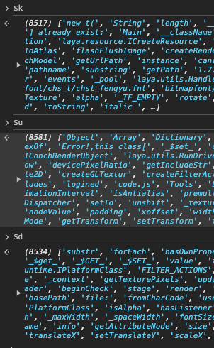

# 雀魂code.js文件解混淆

read this on Bilibili: [cv36277616](https://www.bilibili.com/read/cv36277616)

Q: 什么是 `code.js`?

A: `code.js` 是雀魂的核心 JavaScript 文件, 几乎所有算法, 资源架构都可以在这里得到分析, 
但该文件进行过 JavaScript 混淆, 关键内容被统一存放在了开头一个庞大的全局数组(字典)里面, 没有可读性.

下面简要解释怎么解混淆使其更加容易阅读, 即把引用字典的部分展开成字典对应的内容.
解完之后就很容易得到雀魂的一些算法的原理, 包括匿名牌谱与普通牌谱之间的转换和三种 `id` 之间的关系

## 前置工作

这一步现在可以忽略, 因为这个仓库中有 `code.js` 了, 在 [codejs](../../codejs) 文件夹中.
接下来直接阅读 [CodeDecode.py](../../CodeDecode.py) 这个文件就行, 不过还是简单说下方法 

浏览器登录网页版雀魂, `F12` 打开控制台, 在 `Network` 界面找到 `code.js` 文件, 
在调试器预览该文件, 如果没有格式化(所有内容挤在一行)就点下面的 `{}` 格式化, Ctrl + A 全选预览中的内容, 
复制, 粘贴到本地一个空的 `js` 文件中(记为 `code.js`). 该文件非常大(10M的文本文件), 相关操作会有点卡. 
(以下展示的是2024年7月22号版本的 `code.js`, 不同版本会有不同)

打开 `code.js`, 选中非常长的前三行剪切到另一个空的 `js` 文件中(记为 `dict.js`)

这样就完成了基本前置工作, 此时 `code.js` 文件去掉了前三行, 而且 `dict.js` 只有三行

## 解混淆脚本

该脚本分为两个部分, 第一部分是将 `dict.js` 中的文件读入内存, 第二部分则是还原 `code.js` 文件中引用dict.js的部分.

不过这里在 `github` 上直接阅读这个文件就行了: [CodeDecode.py](../../CodeDecode.py) . 不需要我再一个一个地贴图, 我注释已经写的很详细了.

稍微提一点, 如何判断对字典 `dict.js` 文件的读取没有出错: 一般只要看三个字典数组的长度能不能对得上就行, 
在浏览器 `Console` 界面的是真实长度, 在脚本里 `print` 的是读取长度, 对不上就折半查找看到底出了问题.

最后啰嗦一下 [codejs](../../codejs) 文件夹下的文件: `code_origin.js` 是原来的完整文件, `code_decode.js` 是解混淆后的文件
`dict_format.js` 是格式化后的那三行字典文件
