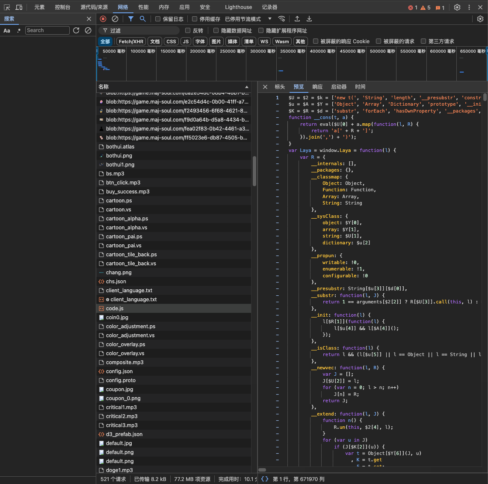
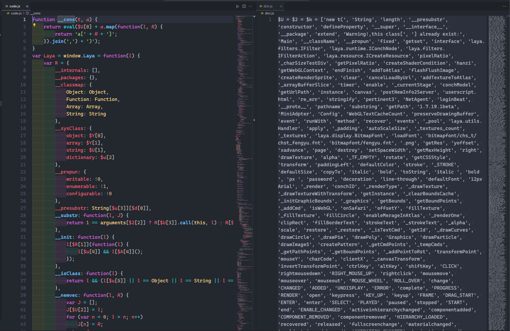
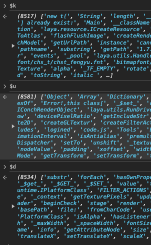

# Decryption of Mahjong Soul's code.js file

中文版: [README.md](./README.md)

---

Q: What is `code.js`?

A: `code.js` is the core JavaScript file of Mahjong Soul, in which almost all the algorithms and resource distribution can be got analysed
but this file is encrypted, with all the key infomation is generalized in 3 global dictionaries at the head of the file, so it is hard to read

below are how to decrypt this file.

## Pre-work

this step can be ignored due to this repository containing `code.js` under [codejs](../../codejs) folder,
so just read the python file [CodeDecode.py](../../CodeDecode.py), detailed steps are below 

login Mahjong Soul via browser, `F12` to open Console, find `code.js` in `Network`, 
preview this file in the debugger, if the contents are not formatted (just one single line), press the button `{}` to format, Ctrl + A, 
copy, paste to an empty local `js` file (name `code.js`). This file is very large (10M text file), it may have some stalling. 
(below picture is the `code.js` of 7/22/2024, different versions contains different contents)

open `code.js`, cut the first three lines into another empty `js` file (name `dict.js`)

now pre-work is done with `code.js` losing the first three lines and `dict.js` having only three lines 

## The decryption script

This script has 2 parts. The first one read `dict.js` into memory and the other one expand the quotation in the `code.js`

just read the code in the script [CodeDecode.py](../../CodeDecode.py)

In addition, how to judge whether there is something wrong when reading `dict.js` into memory?
Just look at whether the lengths of the 3 dictionaries corresponds to the true lengths,  
true lengths can be shown in the browser `Console`, three `print` in the script is the three lengths 

