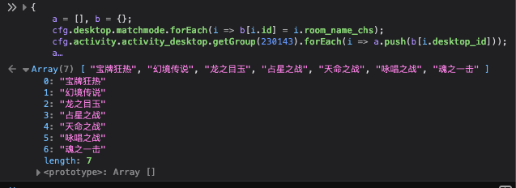

# 查看轮换的活动场的轮次顺序

23年初雀魂的跨年活动开始后, 比赛场新增了每周轮换的特殊规则的活动场, 但游戏中并没有给出各种场次具体的轮换顺序,
下面通过网页调试的方法查看轮换队列.

电脑访问网页版雀魂(可以不登录账号), F12打开控制台, 将下列代码输进去回车:

```js
{
    let a = [], b = {};
    cfg.desktop.matchmode.forEach(i => b[i.id] = i.room_name_chs);
    cfg.activity.activity_desktop.getGroup(230143).forEach(i => a.push(b[i.desktop_id]));
    a
}
```

控制台会直接显示轮换的队列(循环队列), 比如24年10月份的轮换队列是

1. 宝牌狂热
2. 幻境传说
3. 龙之目玉
4. 占星之战
5. 天命之战
6. 咏唱之战
7. 魂之一击

如果当周的模式是魂之一击, 那么上周的就是咏唱之战, 下周就是宝牌狂热, 由此往复



不过还需要注意一点: 目前一年两度的联动活动每次都会出新模式, 活动结束一段时间之后会添加进队列, 不过变化不是这么简单,
首先会打乱已有的顺序重排, 其次还有可能去掉已有的模式. 比如23年轮换模式刚实装的时候, 轮换队列中是有"配牌明牌"模式的,
现在已经去掉了, 个人猜测这个模式应该没什么人玩, 轮换队列太长导致周期拉太长也不合适, 去掉把位置留给其他更好玩的模式也挺好.
