# 雀魂活动安排及抽卡相关资源分配流程

read this on Bilibili: [cv14866403](https://www.bilibili.com/read/cv14866403)

**超长文警告：此专栏约10000字，最后4500字是题外话**

## 肝单抽券总体思路

使用铜币在修罗等活动场（赤羽，还有那个每周轮换的活动场，纯刷粉赤羽用时最短）或三麻东场肝对局，将一姬的礼物盒和段位宝匣中的礼物分解为星之粉尘，然后到福袋屋兑换寻觅卷轴。

### 注意：不管怎么样，该思路十分低效。除非你非常喜欢打麻将，否则根据实际表现看，硬肝对局的时间和精力不如多加一会儿班或者找份兼职然后把money氪给猫粮来的快和简单（虽然很不想让铁公鸡哈基米粮吃到甜头，但这样确实还是比强肝对局来的快），无情的刷粉太过于黑奴了。（游戏是虚拟的，现实生活更美好）

## 长期玩家大致组成

雀魂这游戏因为福利特别差（猫粮狗卡一家亲）+抽卡和服饰很贵导致长期游玩雀魂的玩家的氪金水平也基本呈现两极分化的趋势：

1. 零氪
2. 微氪（基本是月卡党，很少买服饰，总氪金量很少超过1k）
3. 重氪（基本都在5k朝上，8k，1w左右或更高）

所以雀魂的长期玩家可以看成没有”中氪”这个群体的。

## 概述

首先确认一下雀魂里的可利用"资源"有哪些。

**铜币，辉玉，服饰券，宝玉，礼物（绿，蓝，紫），粉尘，寻觅卷轴，信仰，许愿石，星之石。**

辉玉和服饰券是重要的氪金资源，基本只与氪金量有关，零氪的情况下就是0。许愿石和星之石只能通过抽卡得到，不是重氪也几乎为0。而宝玉除了在插画屋购买插画外只有在缔结契约（婚）时能用到；粉尘的获取途径几乎只有礼物分解；寻觅卷轴（单抽券）和信仰（天井）是我们的目标。我们能利用的只有铜币和礼物，也就是如何高效获得，使用这些东西。
我们最希望得到的东西就是“寻觅”中的角色，其次是装扮和契约服饰（婚皮）。

在介绍资源之前，作为一个玩雀魂很长时间的玩家，我先讲一下猫粮是怎么安排雀魂的活动的。

## 雀魂活动的安排

通常来说，雀魂平均每个月有一次活动。比较重要的是大活动（时长三周），具体时间就是每年的一月（过年），四月（联动），八月（夏日祭），十一月（联动），十二月（冬日祭，这个比较特殊，因为时长两周到三周不定，21年22年16天，23年三周，规模和资源介于大活动和标准活动之间）也就是一年有五次大活动（其中两次联动）+七次标准活动（时长两周），活动开始时间都在周三，一般都会停服更新维护。只有大活动才有单抽券2张（冬日祭只有1张），除此之外活动标准资源都差不多，除去不好计算的装扮之外，总结一下就是：

- 单抽券*2（仅限大活动，冬日祭只有1张）
- 随机紫礼物*3（没有特殊说明，以下指的礼物都是随机的）
- 随机蓝礼物*6（大活动固定3紫6蓝，冬日祭一般3紫5蓝，标准活动通常是3紫5蓝或2紫6蓝）
- 十几万铜币（大活动会到二十多万）
- 八种宝玉各1个

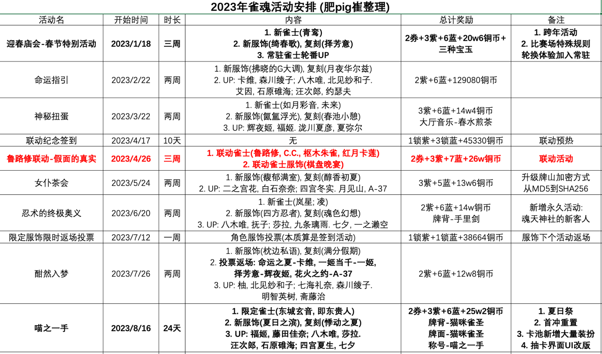
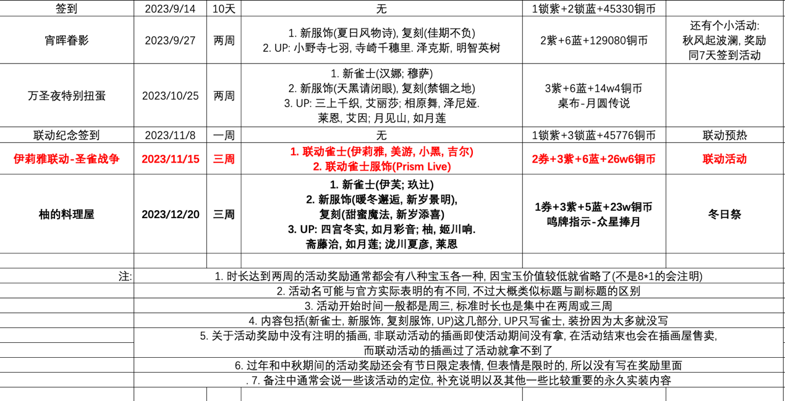
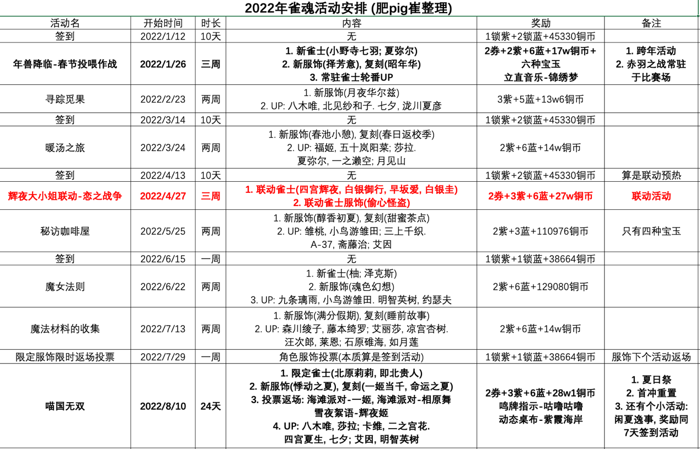
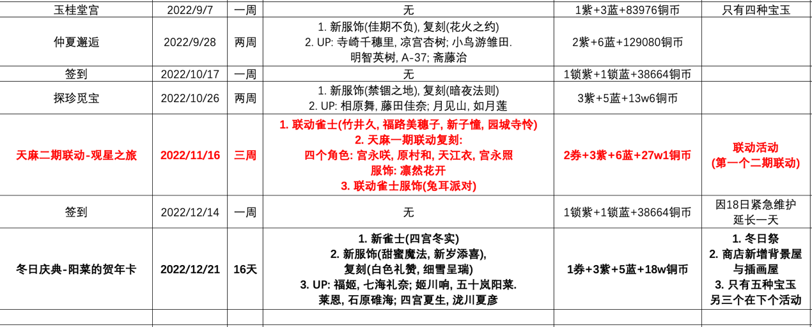
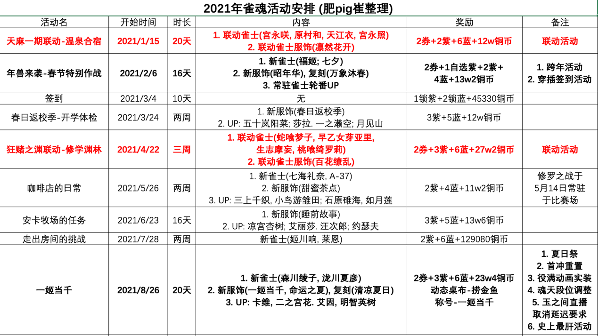
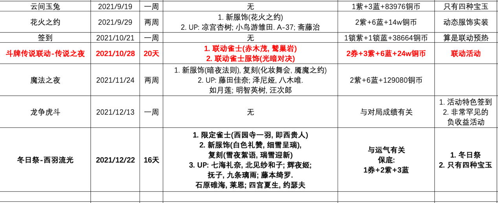

活动奖励数据参考了[雀魂info](https://mahjongsoul.info/category/kouryaku)的攻略。

此外大活动还会有一些资源通过邮件发送，可能会有单抽券+紫蓝礼物/少量宝玉+若干铜币
（**就单抽券来说，元旦夜1抽，跨年活动除夕夜1抽，一次联动活动共5抽，夏日祭1抽，加起来13抽，算上五个大活动本身的，总计22抽**
。有额外送抽那就一定有对猫粮很重要的事件，比如[23年6月25日](https://t.bilibili.com/810991466151149574)
的实际原因是庆祝外服注册人数达到一千万），过年期间的邮件还有比较重要的”自选紫礼物”（元旦夜1个，除夕夜1个）。但这些礼物都是带锁的（
**只要不是通过活动标准资源，抽卡，开宝匣或福袋屋购买获得的礼物都是带锁的**），不能分解为星之粉尘，只能喂角色或者用来婚。

除了上述活动，还有少量时长为一周的小活动，比如”紧张刺激的签到活动”，通常只有1紫礼物+1/2个蓝礼物+一些铜币（礼物也都是带锁的。看安排的天数，签到7天是2个蓝礼物而5天是1个，但每年两次联动前的预热不论几天都固定3个”喵趣券”蓝礼物，这个也是从23年4月”鲁路修”联动的时候开始的）。还有皮肤投票返厂活动，频率大概每年一到两次。

此外还有情人节，七夕节等少数特殊节日会有一些”情人节巧克力”，”喵趣券”，”咖啡券”之类的蓝礼物，通常是7个，每个季度还有四象战，年度的麒麟战也有兑换码的蓝礼物或紫礼物，除了”同心结”之外也都不能分解。

再此外还有雀魂动画的周边bd礼品码（雀魂PONG，雀魂KANG），bd码东西挺多的，特别是紫礼物比较多，还有平常见不到的“十连券”和“皮肤自选券”。当时刚出的时候雀魂PONG的光盘实体加上两个码好像有四百多，对于氪金玩家来说已经很值了。只不过目前雀魂PONG的码已绝版（就算有也能炒到1k或更高），现在可以期待雀魂KANG的码。礼品码的详细内容可以自行搜索。

以上就是正常情况下猫粮的雀魂活动的安排（也有不正常情况下的，比如服务器崩了紧急维护，但补偿通常最多只有一个紫礼物和若干铜币，与此对应的是有事先通知的正常的维护，没有任何补偿），要想获得资源就要分析以上活动。

下面开始介绍各种资源。

## 铜币

### 获得来源

- 活动
- **复活币**
- 每日悬赏任务
- 对局结算

先说结论：如果每天不会长时间打玉或王座之间，雀豪及以上段位铜币最重要的来源是复活币。各段位对应的复活币如下（四麻三麻取段位高的。在铜币量低于该值的时候，每天可以领一次）：

- 初心 无
- 雀士 4500
- 雀杰 9000
- **雀豪及以上 18000**

简单算一下，每个月雀豪如果全勤领复活币就会有54w铜币，远比活动的十几万多。

所以段位也很重要。一般来说，为了刷礼物，段位至少要到雀杰（不稳）。雀豪是比较稳的。

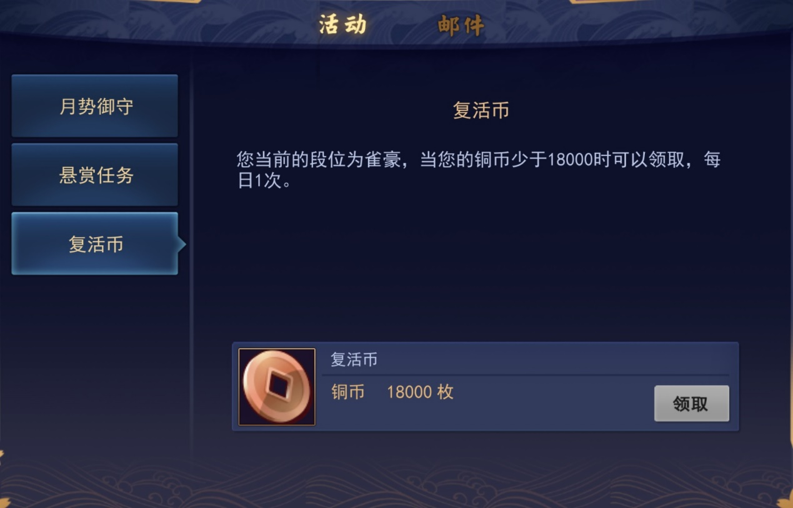

如果你是新手双初心，那么推荐从三麻打，三麻打得快且更容易上分。而且注意一个细节，不要换角色，也就是一姬和二姐选一个定死。因为银之间及以上段位对局会增加角色好感度，而后面获得羁绊之心只需要一个满五星好感度的角色。

悬赏任务也可以做，如果任务难做可以刷新换一下，一天一次，如果氪了月卡会多一个。

### 支出去向

- **对局结算和场代**
- 杂货屋购买（礼物，不推荐买宝玉，因为零氪/微氪情况下宝玉是过剩的）

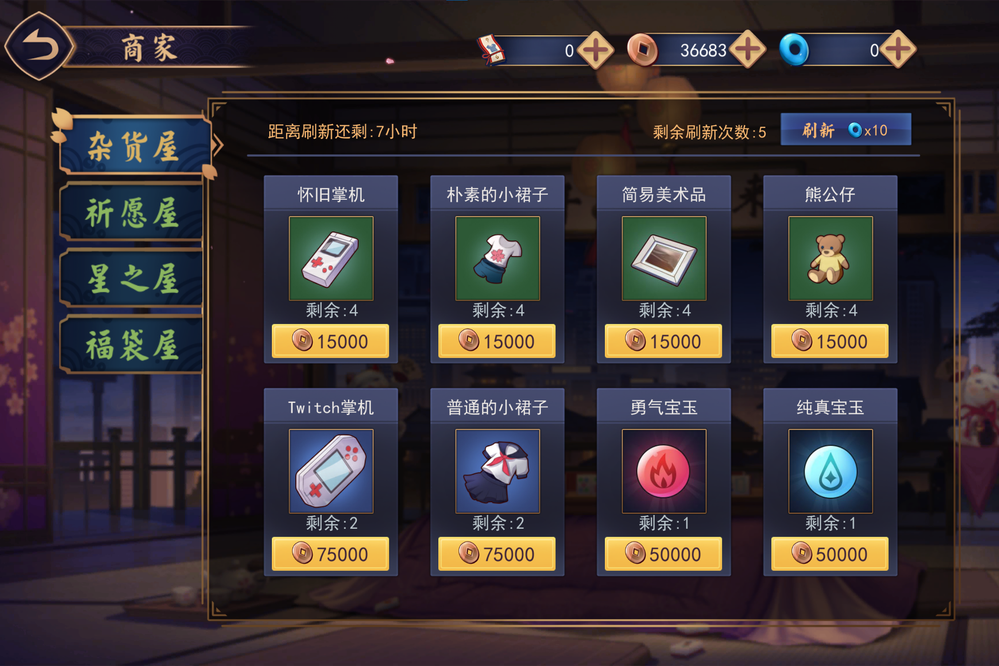

**金之间东场铜币结算方式（修罗等活动场同此）**

- 入场料（低于该值无法进入）：5000
- 兑换比例：1000分：100铜币 （依据顺位马点）
- 场代（额外扣除的铜币，相当于“门票”）：1000

银之间东场各项指标为金之间的一半

玉及王座之间东场各项指标为金之间的2倍

南场各项指标都是同级东场的1.4倍

比如玉南的入场料是5000\*2\*1.4=14000，场代是1000\*2\*1.4=2800

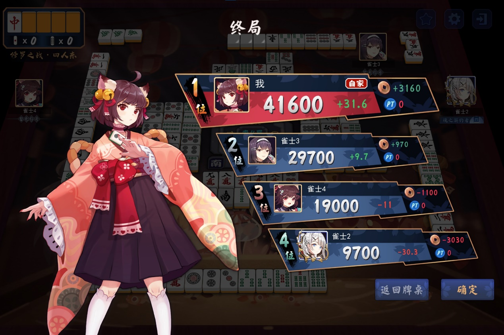
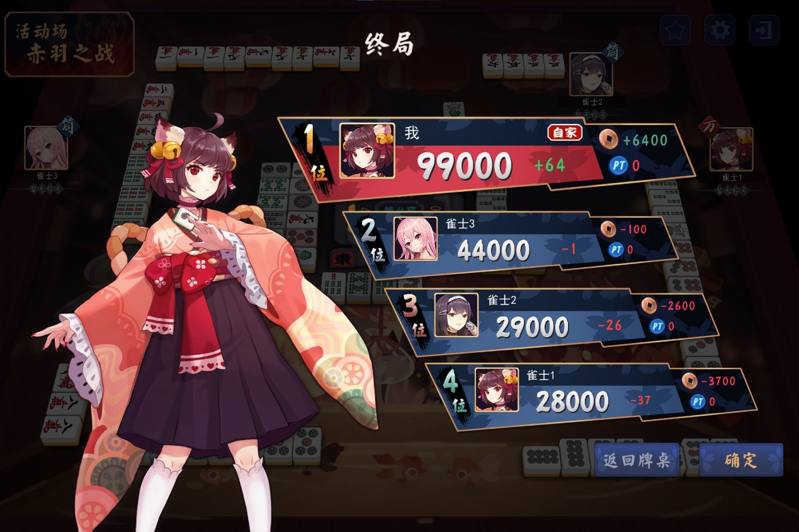
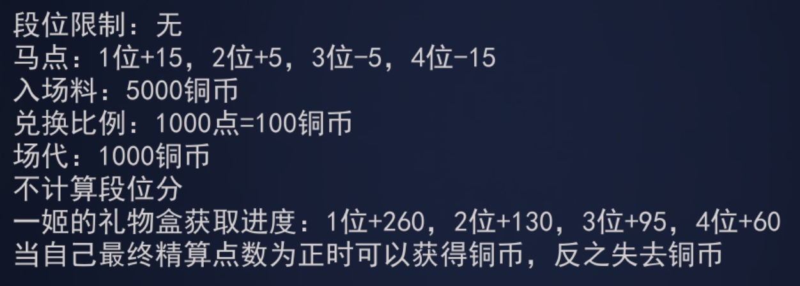

铜币最高效的支出方式是在银之间及以上段位场和修罗等活动场对局（铜之间不行因为铜之间不消耗铜币，
**事实上没有入场料要求的场次是不会有对应宝匣和角色好感度加成的**，比如休闲场，友人场，大会比赛场），以获得一姬的礼物盒或段位宝匣，而不是直接到杂货屋消费掉。

各种宝匣的价值，一般来说对应的场次越高级宝匣奖励越丰厚，入场料要求也会越高，根据我搜集到的信息，相应宝匣对应换算成粉尘之后的大致价值如下（蓝礼物是5粉尘，绿礼物是1粉尘，宝玉不计算）：

|   宝匣   | 等效粉尘 |
|:------:|:----:|
|  银之宝匣  | 2.0  |
| 一姬的礼物盒 | 2.2  |
|  金之宝匣  | 2.9  |
|  玉之宝匣  | 3.4  |
|  王者宝匣  | 3.7  |

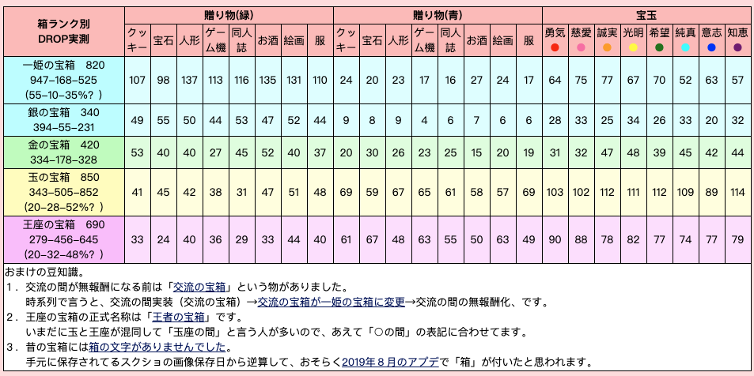

图片来源是雀魂db引用的[某个网站](http://nekomimi.ws/~nikukyu//jantama/jt_gatyamain.html#hikakin)

比较惊讶的是礼物盒价值和金宝匣差挺多而和银宝匣很接近，不符合活动场和金东场场代相同的情况。后来考证发现上图的作者有这样的结论：“一姬的礼物盒有用金之间的场代换取银之宝匣的倾向”。简单的说就是礼物盒价值和银宝匣差不多，但活动场的场代和金之间一样，理论上稍微有点亏。

越高级的段场越难打，平均顺位和铜币消耗也会上升，也很费精力和时间。这方面三麻就会比四麻好一点，三麻对局比四麻快。而修罗等活动场就更胜一筹，因为不计算段位分，玩家打法会更随意一些，而且打活动场的玩家段位水平也比较低，也更容易拿到低顺位。所以一般来说，除了擅长打三麻又不在意三麻段位，可以在段位场打（而且仅限东场，不能在南场因为效率比东场低），其他情况都在修罗等活动场打。

**总结一下就是：东比南高效，三麻比四麻高效**，于是选择就限制在三东和活动场。而且因为三玉东铜币消耗很大，所以三麻刷粉通常在银东或金东。

---

下面简单计算一下为什么铜币花在修罗等活动场比直接在杂货屋买礼物高效。

首先，一姬的礼物盒进度满1000可以获得礼物，进度只与顺位有关，每局顺位对应进度加成如下：（段位场的宝匣在四麻东场同此）

- 1位 +260
- 2位 +130
- 3位 +95
- 4位 +60

这种加成安排明显是鼓励争一的。一般来说，稍微认真打的话，平均顺位不会超过2.4（低于2.3，2.2也是有可能的，可以根据自己的情况进行计算，当然，更科学的计算方式是算平均每局进度而不是平均顺位），平均每8局就可以拿到一个礼物盒，不算场代的话铜币大概正负0，总铜币支出只有场代，8\*1000=8000。

而一姬的礼物盒的价值按照上面是2.2，现在取2个绿礼物，在杂货屋需要30000铜币，远比8000高。

也就是说，平均下来，每进行一场对局，就省了(30000-8000)/8=2750铜币。

而如果你所用的角色好感度达到五星，那就更省了。

角色好感度达五星在银之间及以上段位场和修罗等活动场可以获得羁绊之心，相当于一个蓝礼物。总进度1000，每局进度只与所在场次有关，零氪四麻东和三麻南+40，三麻东+25，四麻南+60（如果氪金的话根据契约等级还会加成的更多，两个月卡的氪金量就能让好感进度翻倍，详情可以到契约等级里查看）。

也就是说，零氪每局再省75000/(1000/40)=3000铜币。

这样就5750铜币了，氪金的话还会加成更多。

这也是为什么前面说要定死一个角色，因为只使用一个角色好感度可以更快到五星，从而可以获得羁绊之心。

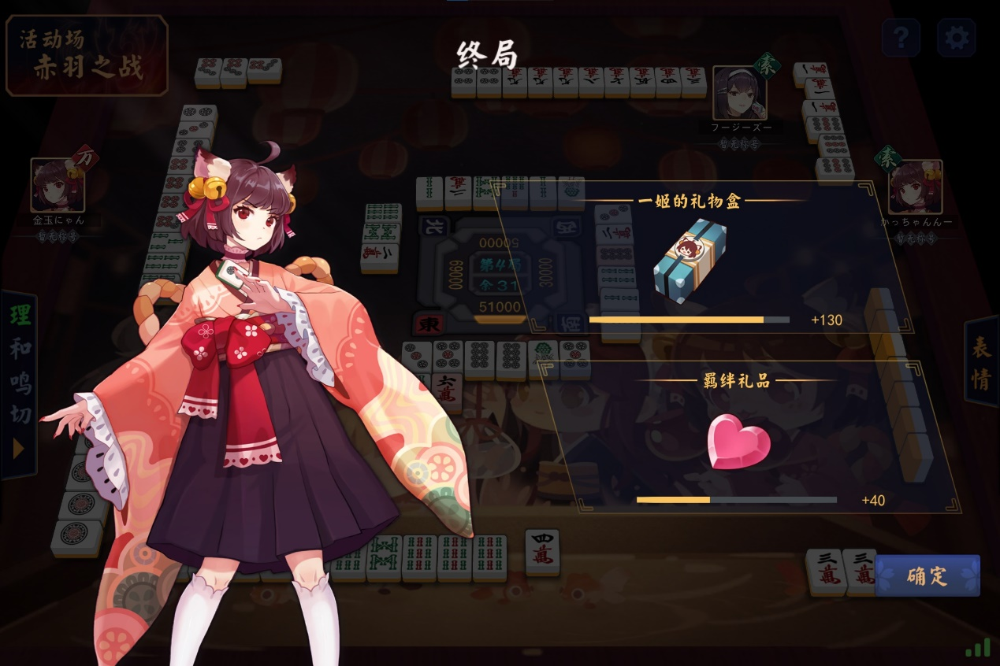
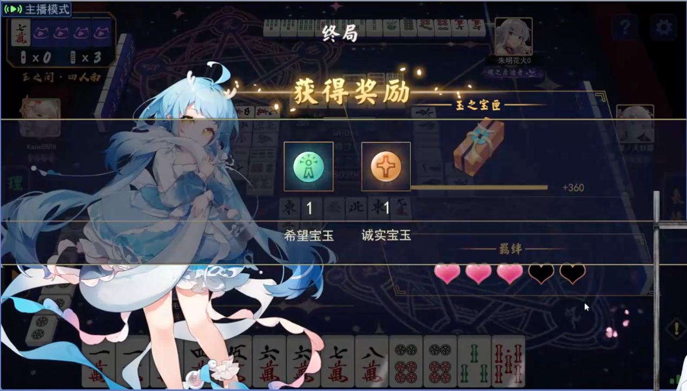

（图片源：蓝毛直播间 [BV1iw4m1Q7CY](https://www.bilibili.com/video/BV1iw4m1Q7CY)）

那什么情况下可以把铜币花在杂货屋呢？可以在今天不想打了但铜币不够低到领复活币的时候。这样其实就衍生出了一种养老做法，就是每天上线领复活币后买完礼物就下线。

## 礼物

### 获得来源

- 活动
- **宝匣（银之间及以上段位场的宝匣，修罗等活动场的一姬的礼物盒）**
- 杂货屋购买
- 大赛礼品码（带锁）
- 福袋屋购买

上面分析过，每个月都有活动，按高了算3紫+6蓝。除此之外的来源就只有宝匣了，就是上面提到的开礼物盒。

大赛礼品码通常指四象战和麒麟战，每次四象战总共能有1紫+7蓝，但都是带锁的。

不推荐在福袋屋购买礼物（三种福袋），尤其是绿，蓝礼物，因为福袋屋消费的是粉尘，这是一个损一半的循环，非常亏。

### 去向

- **分解为星之粉尘（仅限不带锁）**
- 送给角色增加好感度
- 紫礼物参与角色缔结契约

这里，第3点的存在导致紫礼物的去向与绿，蓝礼物有着本质区别。紫礼物很珍贵，所以一般不会分解或送给角色，但你想要婚的角色需要的不是这种礼物或者过剩，那就无所谓。

每个月活动的3紫+6蓝换算一下就是105粉尘，剩下的就只有靠开宝匣了。

当然如果你想婚某个已有的角色，可以根据自身情况，喂角色喜好的礼物（微氪），或者所有不需要的礼物（重氪），自己定夺。

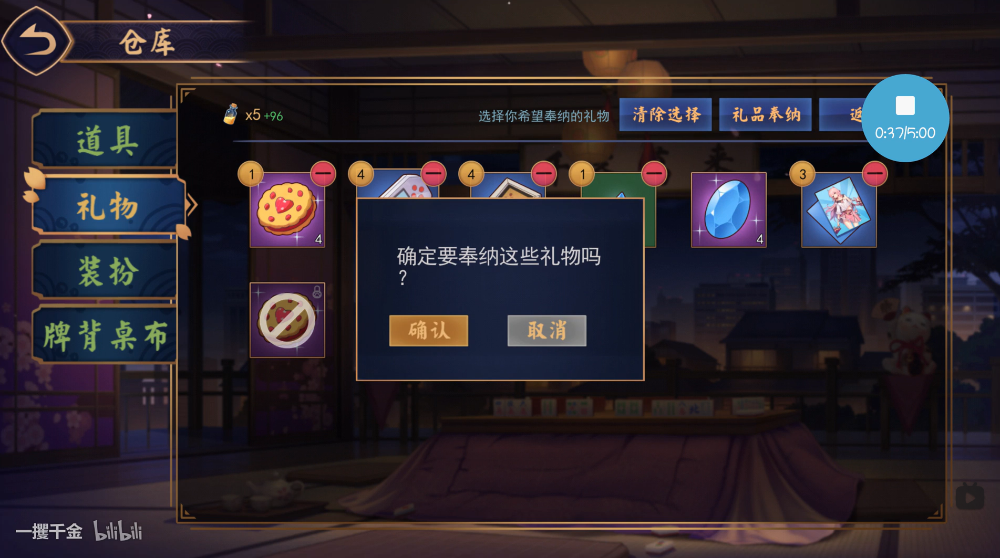
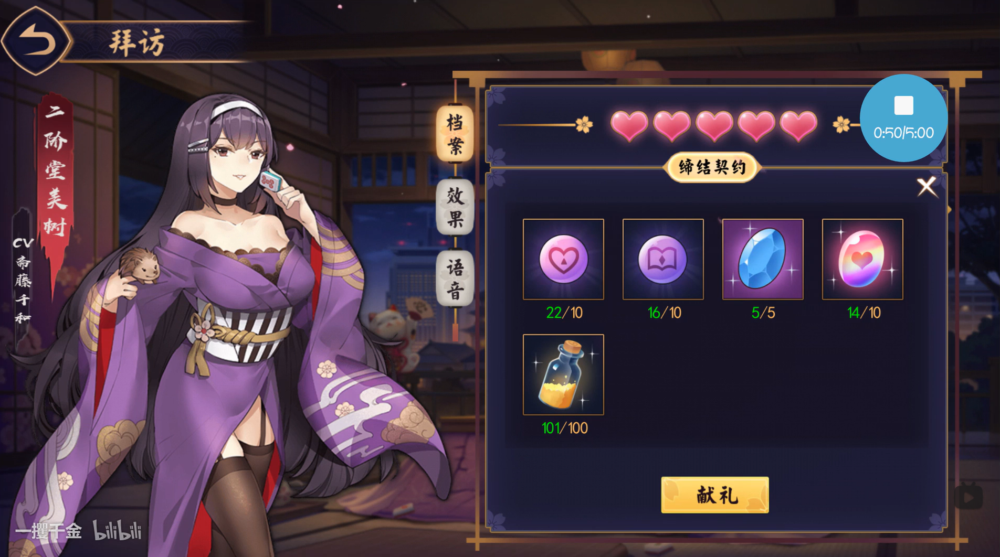

（图片源：[BV1V4411Y7yw](https://www.bilibili.com/video/BV1V4411Y7yw/)）

## 粉尘：

### 获得来源：只有礼物分解（250氪金档位还会送100）

- 绿礼物 1
- 蓝礼物 5
- 紫礼物 25

### 去向：福袋屋

- **寻觅卷轴（50粉）**
- 贤人福袋（紫礼物）（50粉）

毫无疑问粉尘最重要的就是兑换单抽券了。

至于兑换紫礼物，只有在你十分中意某个已有的角色而且紫礼物数量不够婚的时候才会考虑，是下策中的下策，因为有随机性。这是一个无底洞，所以还是不推荐的。

---

## 寻觅

**寻觅卷轴用来寻觅，也就是“抽卡”，这是我们目标的核心。**（抽卡界面在23年8月夏日祭活动之后有UI改版，图中的是老版界面）

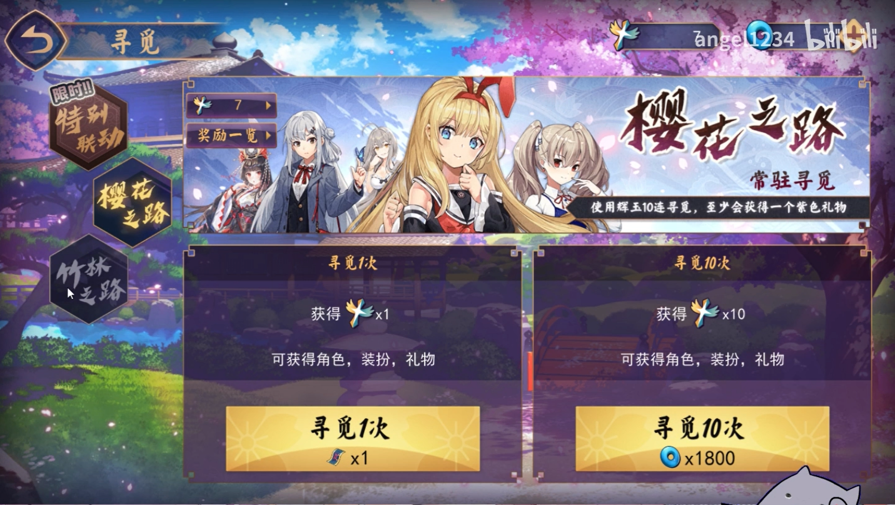
（图片源：[BV12r4y1T76g](https://www.bilibili.com/video/BV12r4y1T76g)）
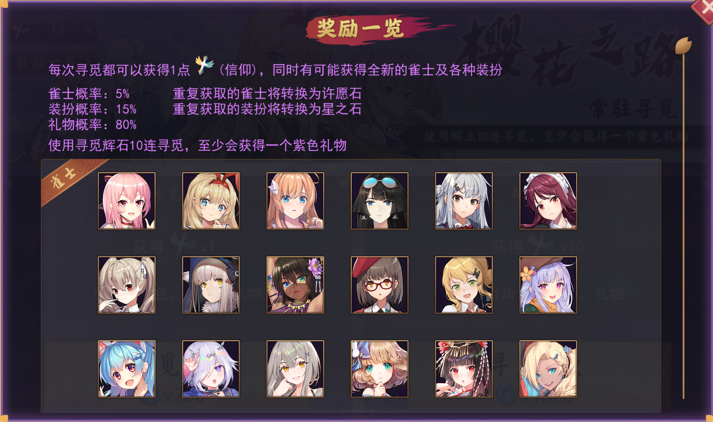

稍微提一点，攒10张单抽券是不能进行10连抽的，只能一张一张抽。

寻觅概率分布：

- 角色 5%
- 装扮 15%
- 礼物 80%

活动另开池子也是可以注意一下的，喜欢某个角色也可以等到UP的活动池里抽。

一般情况下，1次寻觅通常是1个蓝礼物，所以通常结果是“50粉尘变5粉尘”（雀魂炼金术）。

**雀魂的抽卡概率比一般的二游略高，但因为没有保底只有天井所以方差有点大，而且特别容易歪。玩家之间的欧皇度差距太大了。**

---

**每次寻觅后会有1信仰，也就是天井，各池子共通并可以继承（猫粮最后的良心）。这个也是非常重要的，兑换如下：**

- 角色 150 （一般情况下，猫粮自己出的限定角色会到300，比如四贵人系列）
- 装扮 50
- 许愿石 1

对于重氪和微氪玩家来说，井肯定是优先给角色的（一般会留给限定角色，比如联动角色），重氪玩家通常不缺许愿石，所以婚角色的话不需要用井换，微氪就不好说了，没有的话只能用井换，零氪更是如此，而且基本没有井角色的可能（也不是不可能，也就是要玩好几年吧）。

---

**大致就是这些，再稍微说说星之石和许愿石。**

星之石通常只有重氪玩家会有一定的存量，能换的东西都比较一般，看自身喜好。

许愿石同理，零氪和微氪一般用来婚，重氪过剩的话可以到祈愿屋兑换紫礼物和宝玉。

---

## 两道计算题

下面简单做一下两道计算题

### 一. 零氪玩家如果清空每月福袋屋的五张单抽券需要打多少把修罗等活动场？

五张券=250粉尘，每月活动105尘（方便计算，实际比这少），这样需要额外打145尘，一个月30天的话，算上之前大概率会抽到的蓝礼物（5*
5=25尘），平均每天要刷4粉尘。

依然引用上面的数据，平均8把一个一姬的礼物盒，平均2个绿礼物，每局0.25粉。

那每天需要打16局。

即使快了算，平均每局15分钟，那么也要4个小时（非常肝）。

如果你使用好感度满5星的角色，那每局额外增加5/25=0.2粉。

需要4/(0.2+0.25)=9局，2个小时多（也很肝）。

而如果活动的礼物要留着喂角色或用来婚，那所需时间还会更长。

这就是为什么文章一开始说这很低效很黑奴，不要违背自己兴趣花太多时间在一个很低效的事情上。

### 二. 假设有这样一种玩家：雀魂所有活动资源都拿满，但除此之外很少打雀魂。铜币能买礼物就买，礼物能分解就分解，单抽券能换就换。那该玩家一年能有多少张单抽券呢？

平均每次活动100尘（实际比这略少），那总共能获得100\*12=1200尘，也就是24抽。假设算上邮件之后，大活动铜币有30w，标准活动有铜币15w，一年能获得的铜币数是：30\*5+15\*7=255w，全部到杂货屋买礼物有170尘，由于还有小活动和肝活动通常也会有宝匣获得礼物，补足到200尘，也就是4抽。这二者加上之前算的22抽，即该玩家一年能获得50抽。

**所以大胆猜测：雀魂全年所有的福利加起来就是50抽**。具体组成是13（邮件）+9（大活动单抽）+24（活动礼物分解兑换）+4（活动铜币买礼物分解兑换）。

（实际上也可以把雀豪全勤领复活币算上，但复活币应该不在福利范围内，就算加上每年也只会多近9抽）

也就是说，不氪金要3年时间才能拿到一个天井。

这要是放到二游的话估计会非常炸裂吧。

## 氪金

最后的最后说一下氪金。目前雀魂不怎么冤种的氪金方式就两种：steam倒余额和mycard点数卡（比较冤种的是硬顶着汇率steam直冲，最冤种的是找水很深的代充和账号交易）。详情可以在b站和雀魂吧搜索。这里说一下价格（只说标价，实际因为汇率和氪金方式会有不同），雀魂只有月卡（月势御守，34RMB）性价比最高，全勤能获得2140辉玉（1RMB =
63辉玉），能有1个十连抽（1800辉玉，单抽要200辉玉），而且因为加了氪金条能省不少肝，具体可以在契约等级里查看。硬氪的话性价比都低的不行，1RMB =
10服饰券 = 20辉玉（有首充）。每年首冲重置在8月夏日祭时期，日服的是在4月联动时期。这样也就看出雀魂的定价（单位RMB）：

- 单抽：20
- 十连抽：180
- 角色静态服饰：88
- 角色动态服饰：150

## 这里是题外话，我尝试分析一下猫粮为什么这么安排福利内容。

前面说了，雀魂的抽卡概率比一般的二游略高。但福利特别差，而且抽卡也贵，皮肤也很贵。根据立直麻将本身的游戏特点，作为pvp偏竞技的游戏，麻将本身的游戏性就已经薄纱绝大多数二游了。角色和装扮之类不会影响玩家的正常打牌（会的话就走腾讯的路子了，那样雀魂早就凉了）。但二游没有角色确实影响游戏体验。同样是以角色为卖点，虽然雀魂自称是二次元麻将游戏，但其实不属于传统意义上的二游，而是把角色当成添头”奢侈品”来卖。这一点也能从雀魂的周边看出，一个印制了雀魂角色的杯子就需要将近100，比O神还坑。还有雀魂的契约等级也能看出。雀魂契约等级（氪金等级）有个档位的奖励有点特殊，就是250这个档位。它包含了10许愿石和100粉尘，正好和婚角色所需要的资源吻合，而其他档位都是礼物或宝玉，对于零氪玩家来说，许愿石几乎只能很伤的使用天井换。这样根据猫粮的意思，雀魂里婚角色，不是零氪玩家该考虑的。婚第一个角色“定价”250。而上面提到过两个月卡的氪金量就能让对局角色好感进度翻倍，不氪金会多耗费很多时间，加起来换算成money也很可能超过250了（这样就又回到了专栏开头的那个观点。可恶，哈基米粮真该死啊）。

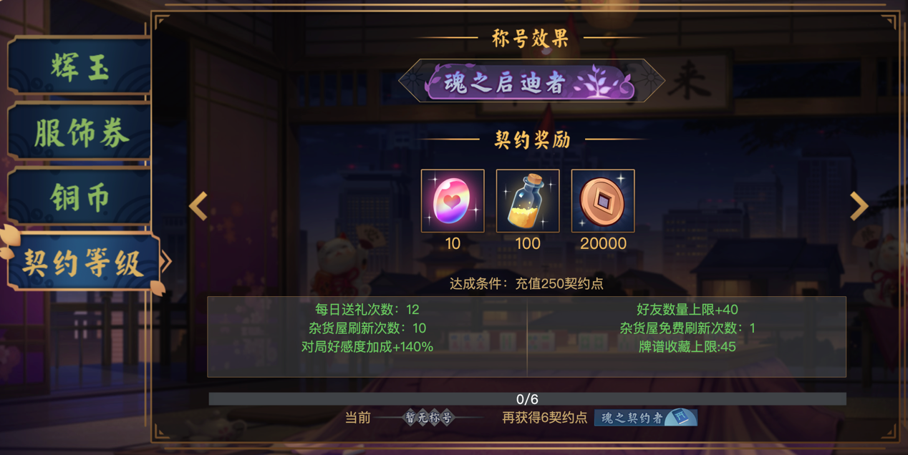

既然是奢侈品，那就需要玩家花很大代价才能获得，这样就对应了福利巨扣与抽卡很贵（也造就了雀魂账号非常保值）。同时，玩家抽角色买皮肤的目的也更加单纯与明确：为了好看养眼，不怎么在乎人设ooc的事情。而二游把角色看成正常商品，二游的可玩性全在角色上，角色的人设和社区相关二创氛围很重要。这是二游的基本盘。这也是为什么24年4月雀魂碧蓝档案（ba）联动的时候国内有不少ba玩家破防，去攻击雀魂玩家却发现根本打不过，然后国内ba社区有崩坏的现象。

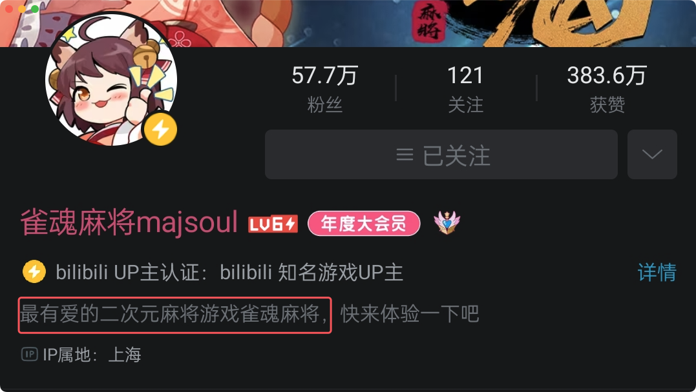
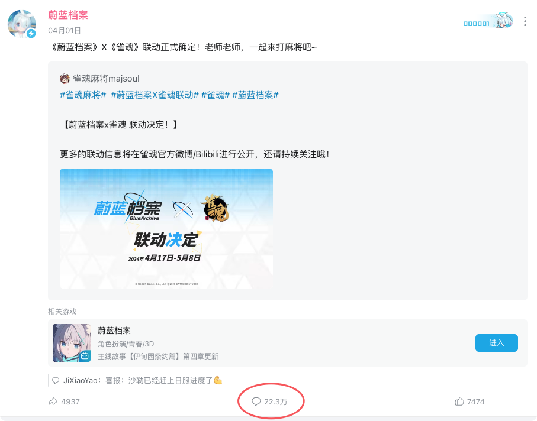

**以下是常见问题。**

### 一. 雀魂是不是国产游戏?

是，但是现在没有国服，总部在上海，国内服务器在香港，应该是租借阿里云的服务器。雀魂是18年的游戏，当时猫粮套版号”水晶碰碰”提前上线，这段时间是有国服的。也能直接通过蓝绿修改器氪金。然后20年被制裁了，国服消失。停服一两个月之后”回光返照”“浴火重生”成国际中文服（现在简称国际服）。早在19年猫粮就委托代理公司”悠星网络”(
Yostar)
开始在日本开展业务，后面逐渐演化成日服，再后来又有了美服（英文服），韩服。除了国内的国际中文服是由香港创魂网络公司代理（这个公司估计也是猫粮的套壳，也就是国际中文服是猫粮直营）以外，其他服都是悠星代理的。现在，全服大多数玩家都是日服玩家，且日服贡献了所有服务器流水的近九成，所以，日服是目前雀魂的重点。此外，从天麻开始（21年）的所有联动都是由悠星和版权方谈判协商。

### 二. 猫粮还算是小作坊吗?

不能算了，虽然就猫粮目前”养老”式的产能，躺着数钱的状态，看不出来猫粮有很多正式员工（BOSS直聘上在20-99这个档位），但在23年4月”鲁路修”联动当天日服流水压过了同天开服的mihoyo宣传很久了的”崩坏星穹铁道”（虽然时间不长）。有个图是”今天将会有一个回合制手游登顶”，第一是FGO，第二就是雀魂，第三才是崩铁。从流水上看猫粮已经是彻彻底底的大公司了。

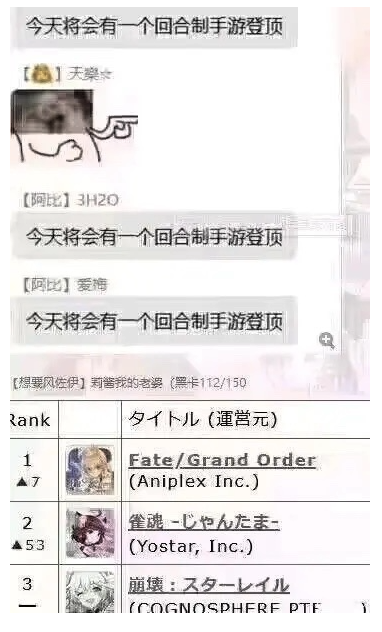

我虽然不是雀魂开服玩家（21年夏日祭活动”一姬当千”时期入坑)
，但回看雀魂的发展史还是挺感慨。19年猫粮蹑手蹑脚，畏畏缩缩的，运营生怕哪里出错。就四麻刚加入王座段场的时候（刚开始雀魂没有王座之间，最高段场是玉之间）雀圣能否继续打玉的设计就能看出，猫粮很不想让玩家感到不爽。当时雀魂的社区也集中在微博，b站，玩家也把雀魂捧在手心上（主要是当时b站推雀姬而给雀魂限流），猫粮那边一些重要人物（叶子猹：曾经b站雀魂官号的运营；丝茉茉：猫粮老板娘；还有个半官方人物蓝毛）也很积极回应社区，是一种玩家和厂商很和谐的状态。20年猫粮被shutdown的时候国内不少玩家感到可惜。浴火重生之后猫粮也很少在社区跟玩家互动了，也变得抠门了起来，汇率原因氪金也变贵了。“我们之间隔了一层可悲的厚障壁”。然后猫粮凭借日服的基础还有21年火龙果之类的主播引流，成功扩圈走红，走上了大公司的路子。只是呢，社区已经不能回到之前19年的那种玩家和厂商和谐相处的状态了。

### 三. 既然猫粮总部在上海，那有没有像其他二游那样的”沪圈””社管”这种东西?

没有，而且我相信猫粮将来也不会有。因为雀魂没有版号，而且国内的刻板印象容易将麻将和赌联系在一起，猫粮操作受限。其次雀魂本质不是二游，它的游戏性不在社区，再加上雀魂的抠门过于著名与”深入玩家心”，没有玩家愿意与猫粮站一块，再者还是因为没有版号，加上国内部分手机浏览器”作梗”屏蔽雀魂官网，提高了入坑门槛，导致雀魂玩家的平均年龄比二游玩家的年龄大，更加有自主性，也更难被”管理”，完全没有”猫孝子”这种说法（不过现在”猫孝子”也在使用，指给猫粮氪了很多的玩家）。顺带说一句，目前雀魂大型社区（b站，微博，贴吧）几乎全体玩家都希望猫粮吃瘪。所以，猫粮想要社管下场完全是费力不讨好的事情。（所以mihoyo为什么不学习猫粮工作室的品德?）

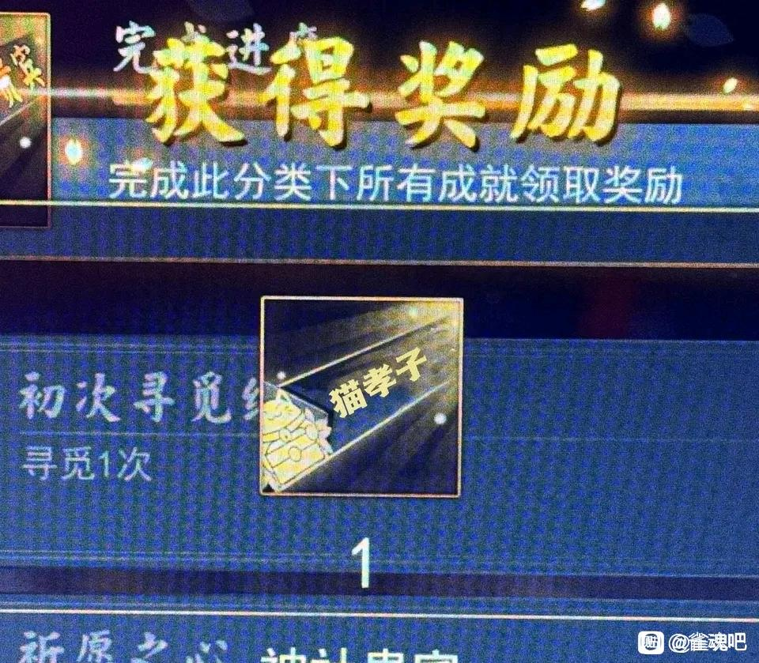

### 四. 雀魂福利扣的这么著名，那为什么没有竞品把它干下去呢?

对啊，为什么呢? **看来是”矮子里拔将军””比烂”。**

雀魂的定位是立直麻将与二次元的融合。早在雀魂刚开服的18年，那时猫粮还真是个小作坊，其实就有个和它对标的游戏，就是上面提到的雀姬。雀姬当时老老实实走了版号流程，所以上线比雀魂晚了一些。再加上雀姬当时角色立绘，UI与打牌手感特别差，bug也很多，与此对应的是雀魂打牌手感很不错，立绘和UI与二次元风格结合的很好。雀姬完全不是先入为主的雀魂的对手，再加上雀姬有版号束缚，角色立绘不能太”奔放”。就算后来20年雀魂套版号被”制裁”停服了一两个月，雀姬也没能乘机取代雀魂的地位。雀魂浴火重生后，不受国内规则束缚，立绘也越来越暴露。雀姬的UI与手感问题也依然很明显，而且作为pvp游戏，在线玩家人数很难拉回来。虽然取得了版号并且获得的bilibili的认证与支持，还发展了steam服，但已经完全丧失了和雀魂同台竞技的可能，目前已处于半死不活的状态。(
18年19年雀魂与雀姬的竞争其实还是有点东西的，特别在b站限流方面，详情可以自己搜索)

然后22年初，日本那边有了一个雀魂竞品，叫麻雀一番街，简称一番街，开始与雀魂竞争。刚开始没有开放国际服，所以国内讨论度不高。后来上架steam，引入繁中版等操作开始进入国内市场，是目前雀魂的一个最有可能的竞争者。但因为角色立绘，手感还有界面太繁杂等原因，最主要可能还是因为先入为主和玩家沉没成本，目前玩家体量仍然不及雀魂的十分之一。虽然目前一番街某些皮肤比雀魂的还要”放飞自我”，福利比雀魂稍好。但在抽卡概率方面比雀魂差，实际福利表现差不多。目前一番街的侧重点好像与雀魂不一样，用贴吧某老哥的话说：雀魂是披着二游皮的麻将游戏，而一番街是披着麻将皮的二游。一番街不在立直麻将本身上下功夫的话，是很难与雀魂分庭抗礼的，如果继续这个方针的话，是不能威胁到雀魂的地位的。一番街的竞争者就会由只有雀魂扩大到整个二游圈，立直麻将本身的门槛导致玩家基数不可能像其他二游一样多，两种debuff加在一起，一番街能稳定分得雀魂的一份羹就已经很不错了，雀魂还是稳如泰山。

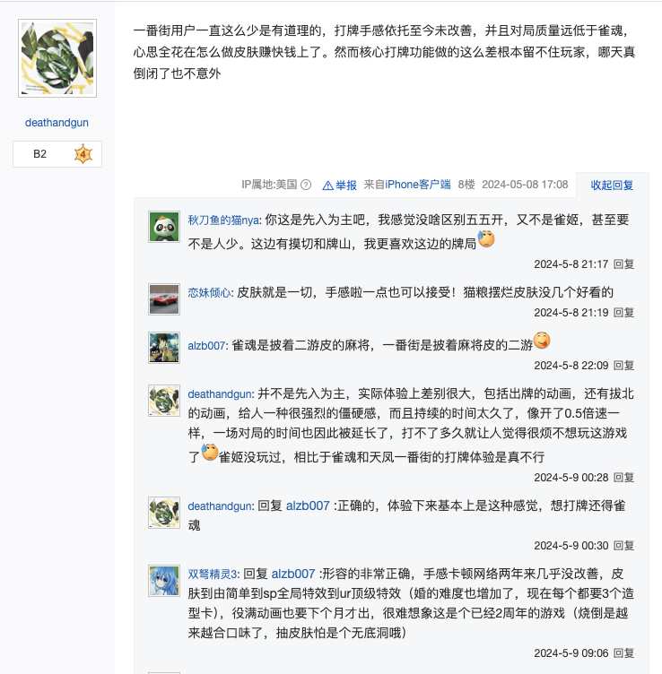

至于天凤，是一个日本的比雀魂早了十几年的硬核纯立直麻将平台。UI还是20年前的那种黑白界面，甚至可以说没有UI，也没有角色，特效之类的。雀魂的一些段位场细则也是借鉴的天凤（避四规则，明杠新指示牌不即翻，无切上满贯等。当然也不是所有，比如雀魂国士能枪暗杠但天凤不能）。适合纯打立直麻将的牌佬（女人只会影响我拔剑的速度）。但有个比较严重的问题是天凤服务器在日本，国人玩家容易掉线，且大势所趋，如果天凤的UI不改进，注定了它会被雀魂取代。当然也有说天凤的天凤位比雀魂的魂天更有含金量。对于这个我的看法是：段位含金量怎样，不仅取决于段位的设计，还与平台的活跃玩家数有关系，只有活跃玩家多的平台段位含金量是不会被质疑的。目前天凤活跃玩家数量是不如雀魂的，天凤UI不改进的话将来差距会越来越大，那随着时间推移，天凤位的含金量就可能要打一个问号了。

还有个比雀魂早的叫雀龙门，是个韩国游戏。这个我了解不是很多，早期的时候还是很风光的，堪比现在的雀魂。但现在基本已经凉了，因为它锁日区+收费逆天。

还有像其他的比如雀皇，麻将传奇，甚至还没上线的掌心麻将，那更是不加掩饰的抄袭雀魂来蹭雀魂的热度。没有流量的情况下pvp游戏完全照抄是肯定没有前途的，根本不可能是雀魂的竞争者。

可恶，友商能不能给点力啊，看到哈基米粮赚钱比我亏钱还难受。总不能期待腾讯的“代号：Riichi”吧？那还是洗洗睡吧，猜测要么是不同赛道，要么跟雀姬一样。

### 五. 现在看来，如何评价猫粮的这种“奢侈品”策略？

其实我觉得很多雀魂玩家没有认真思考过这一点，就是比如说“假如你是猫粮的老板娘丝茉茉，你会采取什么样的策略运营雀魂？”。这种问题不是说让你站在玩家的视角去对症下药，“头疼医头脚疼医脚”，而是要多方面的比较：为什么现在雀魂的竞品这么多但一个能打的也没有？难道只是因为先入为主吗？如果你要做雀魂的竞品，会有哪些困难？知己知彼才能百战不殆。

雀魂的定位是二次元立直麻将游戏，“奢侈品”策略说明猫粮一开始就想把雀魂先定位成一个pvp麻将游戏，然后再考虑抽卡与角色的事情。所以，雀魂的UI很整洁美观，打牌手感很好，对局很流畅。另一方面猫粮也会打击段位不正打现象，积极封禁AI代打，制裁“来一筒”和“小和和”，发何切讨论，升级牌山加密方式从md5变成sha256，古早时期休闲场取消奖励与场代等，来维护段位含金量和玩家打牌体验。而如果猫粮把雀魂先定位成一个卖角色的游戏，再去考虑立直麻将方面的事情，会怎么样呢？那一番街就是一个典型的例子，对应结果就是麻将方面比不上雀魂而发展受限。这样，雀魂就形成了玩家以打牌为主，角色为辅的场面。也可以大胆认为大部分玩家都是不付费的（也对应了“奢侈品不坑穷人”）。当然，一个pvp游戏最重要的是玩家生态（这也是为什么天凤的UI这么简陋但到现在仍然是很受认可的平台），和猫粮的这个策略相符。所以我认为，猫粮的这个策略是正常的，正确的，符合自身定位的（可恶，真不想夸哈基米粮。但该夸就夸，该喷就喷）。

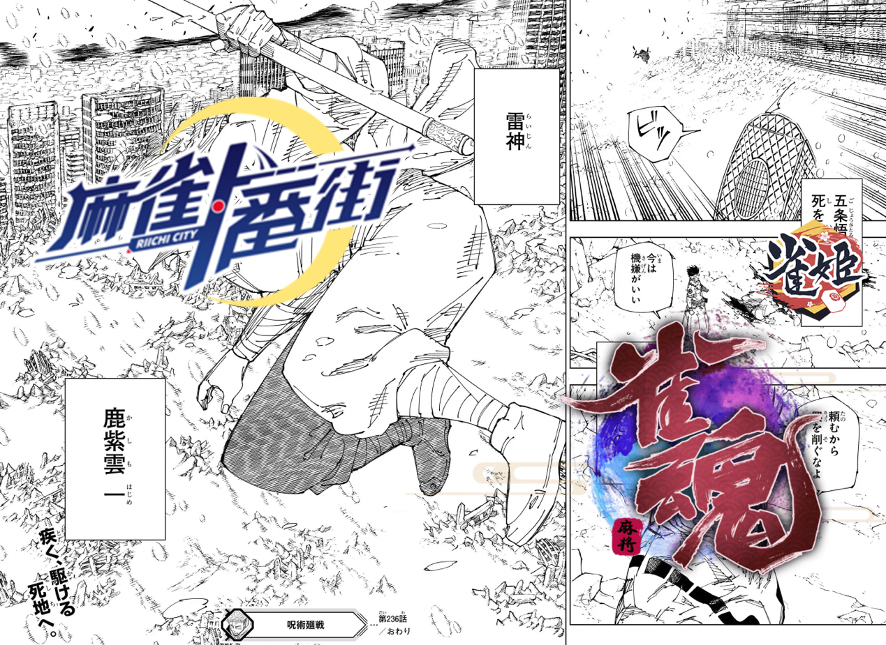

当然也会问：“让玩家氪金的手段不止一条，为什么不选择对很多玩家都友好的薄利多销策略呢？”。个人认为，猫粮没有薄利多销的条件。首先，多销就意味着玩家基础要扩大很多，国内玩家普遍没有游戏付费的习惯，加上立直麻将与国内麻将规则很不一样，本身门槛就高，用户远没有像腾讯系的游戏那么多，二次元又筛选了受众。还有原因是国内容易将麻将与赌联系在一起，玩家数可能会不稳定。其次多销还要对产能和服务器有要求，猫粮工作室员工数很少，产能跟不上，服务器也是成本（就目前服务器都不怎么稳定，三天两头崩溃）。于是猫粮就从质量上下手了（虽然性价比贼低，有些外包的皮肤质量也是一坨）。再者，薄利多销不太符合雀魂以立直麻将为核心的方针。还有根据玩家的感受来说，部分氪金玩家氪到一定程度，就不会再氪了，因为老婆已经够多了“吃不消”，毕竟不是每个氪金玩家都想“后宫佳丽“到”三千人”的程度（比较搞的是官号动态下面有玩家提议新功能“随机角色出战”“后宫翻牌子”）。所以抽卡方面，如果猫粮降低了抽卡单价，或者福利提高了不少，那很大概率会下调出货率和上调天井高度，总体上不会给玩家带来好的体验。

目前雀魂社区很少有系统讨论以上问题的。我玩的游戏不多，以上观点仅抛砖引玉。
