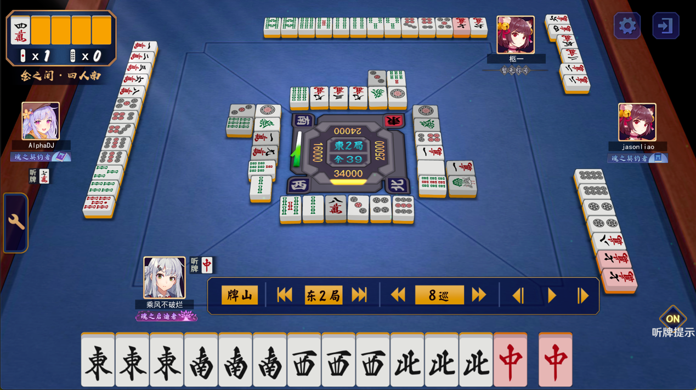

# 雀魂匿名牌谱与普通牌谱之间的转换

read this on Bilibili: [cv36066023](https://www.bilibili.com/read/cv36066023)

---

该专栏将揭示雀魂牌谱链接中匿名牌谱与普通牌谱之间的转换算法(加解密).

举一个比较著名的牌谱:

普通牌谱: https://game.maj-soul.com/1/?paipu=200515-cfbe0120-c92c-44ad-bdfc-ebfef3a33a10_a89702544

匿名牌谱: https://game.maj-soul.com/1/?paipu=jijpmr-0415suwv-971c-67ei-ilom-qottvksmnvnn_a89702544_2

## 牌谱链接的特征

雀魂牌谱的关键信息在链接 `?paipu=` 后面(毕竟前面都是一样的), 可以看到这部分的字符串有很多特征:
1. 牌谱链接删去 `?paipu=` 及之前的部分仍然可以在游戏内查看
2. 只由数字, 小写字母, 短横线 `-`, 下划线 `_` 组成
3. 被一共5个 `-` 隔开, 普通牌谱后面还有个 `_a` 加一串数字, 而匿名牌谱在普通牌谱之上还加了 `_2`
4. 到 `_a` 部分为止, 被 `-` 隔开的部分长度都是相等的, 普通和匿名都一样, 长度分别是 6, 8, 4, 4, 4, 12
5. 普通牌谱的第一个部分是牌谱生成日期(对局结束时), 比如 `200515` 就是 2020年5月15号
6. `_a` 后面的一串数字也是一个 `id`, 同一个玩家的牌谱这串数字相同, 无论是否匿名
7. 同一场对局但不同玩家主视角的谱, 在 `_a` 前面的部分完全相同, 只有这后面的数字不同, 即这个数字是决定你查看牌谱时候的主视角
8. 普通牌谱如果把后面 `_a` 及以后的部分删去(或者其他不相关的数字), 查看牌谱不会出错, 只不过会把主视角重置为东起的玩家

那两种牌谱转换的关键就在 `_a` 之前的那个长度为6+8+4+4+4+12(+5)的部分. 

## 转换脚本

这个没啥好说的, 阅读这个文件就行: [MatchDecode.py](../../MatchDecode.py) . 我注释写的很详细了

B站的原专栏中虽然使用 C++ 展示的, 但都一样, 而且 python 更适合做这种工作 (C++ 是什么过时玩意, 真不熟)

## 关于三种 id 及其之间的转换

见 如何通过牌谱屋或牌谱链接加好友 的 [README.md](../如何通过牌谱屋或牌谱链接加好友/README.md)

## 转换牌谱主视角

通过上面的那个 [README.md](../如何通过牌谱屋或牌谱链接加好友/README.md) 可以得到牌谱对局中其他几家的信息, 也就能得到 `account_id` 和 `match_id`

那把牌谱中的 `match_id` 转换成对应视角账号的就行, 比如这里想把主视角换成上家小鸟游雏田的

得到西起玩家的 'match_id' 是 13858370, 那对应的牌谱就是 https://game.maj-soul.com/1/?paipu=200515-cfbe0120-c92c-44ad-bdfc-ebfef3a33a10_a13858370

根据 [MatchDecode.py](../../MatchDecode.py) 也能得到匿名牌谱形式的: https://game.maj-soul.com/1/?paipu=jijpmr-0415suwv-971c-67ei-ilom-qottvksmnvnn_a13858370_2

