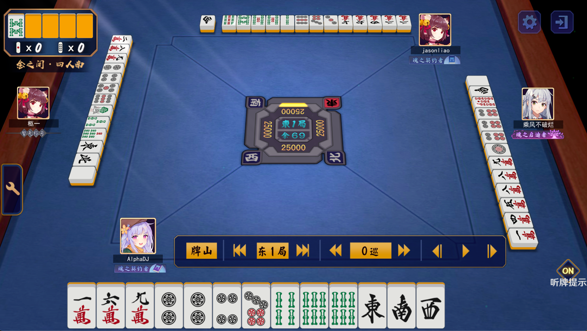

# Transformation between anonymous match links and non-anonymous ones in Mahjong Soul

中文版: [README.md](./README.md)

---

This article shows the algorithm between anonymous match links and non-anonymous ones in Mahjong Soul

show this famous match record as example:

non-anonymous: https://game.maj-soul.com/1/?paipu=200515-cfbe0120-c92c-44ad-bdfc-ebfef3a33a10_a89702544

anonymous: https://game.maj-soul.com/1/?paipu=jijpmr-0415suwv-971c-67ei-ilom-qottvksmnvnn_a89702544_2

## Traits of match links

Key information of match link is behind `?paipu=` (as every link is the same before this). There are many traits:
1. still available after deleting characters `?paipu=` and ones before this
2. characters consisting of numbers, lower case alphabets, `-`, `_`
3. split by 5 `-`,  `_a` with a serial of numbers are after non-anonymous links, while anonymous ones plus `_2` at the basis
4. till `_a` , lengths of the parts which parts split by `-` in every link are the same, no matter anonymity, lengths are 6, 8, 4, 4, 4, 12
5. first part of the non-anonymous link is the date on which the record is generated at the end of the match, `200515` means 5/15/2020
6. the serial of number after `_a` is also an `id`, this `id` of one account is always the same , no matter anonymity
7. links of different main views of The same game record , characters before `_a` are the same and difference exists only after this, so the main view depends on this number
8. if deleting characters after `_a` of non-anonymous links, no errors will occur if view the record of this link, however the main view will be reset to the seat East

The key is the characters before `_a` whose length is 6+8+4+4+4+12(+5). 

## Transformation script

Just read the code of this script [MatchDecode.py](../../MatchDecode.py)

## Transformation of three ids 

read [README.md](../如何通过牌谱链接加好友/README_en.md)

## Change the main view of match record

through the article above [README.md](../如何通过牌谱链接加好友/README_en.md) we can get other players' info as well as `account_id` and `match_id`

so, just change the `match_id` to the main view player's one, for example, change the main view to the left side player

the player's 'match_id' is 13858370, so the match link is https://game.maj-soul.com/1/?paipu=200515-cfbe0120-c92c-44ad-bdfc-ebfef3a33a10_a13858370

due to [MatchDecode.py](../../MatchDecode.py) , anonymous one is also easy to get: https://game.maj-soul.com/1/?paipu=jijpmr-0415suwv-971c-67ei-ilom-qottvksmnvnn_a13858370_2

