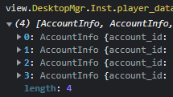

# 如何通过牌谱链接加好友

read this on Bilibili: [cv23616802](https://www.bilibili.com/read/cv23616802)

---

(这里的专栏和代码与在B站的有比较大变化, 但不影响)

这个专栏的内容其实很简单, 就是 id 的转换, 具体算法在这个文件里面: [AccountDecode.py](../../AccountDecode.py) 

原在B站的专栏只有关于两种 id 的转换, 这里的文件把三种 id 的转换都列举出来了

## account_id

这个是最基础的 id, 也是牌谱屋网址里显示的id, 就是这张图遮住的部分

获取账号的这个 id 也比较简单, 只要有牌谱就行, 如果没有牌谱, 但能在牌谱屋查到该玩家也可以

浏览器登录网页版雀魂, F12打开控制台, 在雀魂查看上面那个牌谱, 加载完成后在 Console 里输入 

`view.DesktopMgr.Inst.player_datas`

这个长度为4的数组就是存储玩家信息的, 根据玩家昵称就能获得里面的 `account_id`

## friend_id

加好友的 id, 除此以外好像没什么用

## match_id

牌谱链接后面用于指示主视角的 id, 在牌谱链接后面更改这个可以改变查看牌谱时的主视角

详见 匿名牌谱与普通牌谱之间的转换 的 [README.md](../匿名牌谱与普通牌谱之间的转换/README.md) 最后
