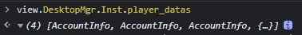
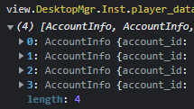

# 如何通过牌谱链接加好友

可能需要用到的网站: 雀魂牌谱屋: https://amae-koromo.sapk.ch

## 玩家的三种id

### 账号id(account_id)

这个是最重要也是最基础的 id, 也是牌谱屋网址里显示的 id, 就是这张图遮住的部分, 游戏内通常不可见

获取 account_id 也比较简单, 只要有牌谱就行, 如果没有牌谱, 但能在牌谱屋查到该玩家的话, 也可以获得牌谱

获取方式: 浏览器登录网页版雀魂, F12打开控制台, 在雀魂查看牌谱, 加载完成后在 Console 里输入

`view.DesktopMgr.Inst.player_datas`

这个长度为玩家数的数组就是存储玩家信息的, 展开就可以查看玩家信息, 根据玩家昵称就能获得里面的 `account_id`

### 好友id

加好友的 id, 可由 account_id 直接转换而来

### 牌谱id

在分享的牌谱链接最后有个以 `_a` 开头的一串数字, 那就是牌谱id, 用于确定进入牌谱的主视角, 也可由 account_id 直接转换而来

## 三种id之间的转换方式

三种id之间转换一共又6种情况, 所以这里直接给出转换函数, `input` 是"=>"左边的内容, 则函数返回的就是右边的内容:

- 牌谱id => 账号id: `game.Tools.decode_account_id(input)`
- 账号id => 牌谱id: `game.Tools.encode_account_id(input)`
- 好友id => 账号id: `game.Tools.decode_account_id2(input)`
- 账号id => 好友id: `game.Tools.encode_account_id2(input)`
- 牌谱id => 好友id: `game.Tools.encode_account_id2(game.Tools.decode_account_id(input))`
- 好友id => 牌谱id: `game.Tools.decode_account_id2(game.Tools.encode_account_id(input))`

使用方式: 电脑访问网页版雀魂(可以不登陆), F12打开控制台, 从上面选择合适的函数, 将 `input` 换成你实际的你已知的id, 回车返回即可

又或者使用我另外用 python 实现的算法: [AccountDecode.py](../../AccountDecode.py)
