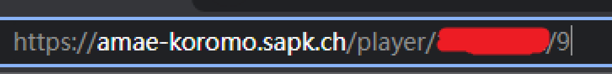
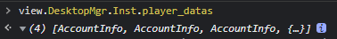

# How to add friends via match links

中文版: [README.md](./README.md)

---

This article is very easy to understand, just the transformation of ids, the algorithm is in [AccountDecode.py](../../AccountDecode.py) 

## account_id

basic id, also shown in the url of [Majsoul Stats](https://amae-koromo.sapk.ch/), which is painted in the picture below

It is easy to get this id, one match link is ok, if not, it is also ok if this player can be found on Majsoul Stats

Login Mahjong Soul via browser, F12 to open Console, view the match record in Mahjong Soul, after loading input these characters 

`view.DesktopMgr.Inst.player_datas`

This 4-length array stores players' info of the match, `account_id` is easy to get via nicknames 

## friend_id

Id to add friends, it is useless despite that

## match_id

Id to change the view of the match links, 

see details at the last of [README_en.md](../匿名牌谱与普通牌谱之间的转换/README_en.md)
