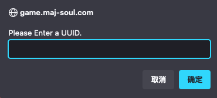
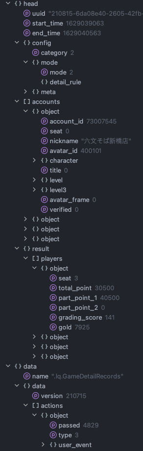
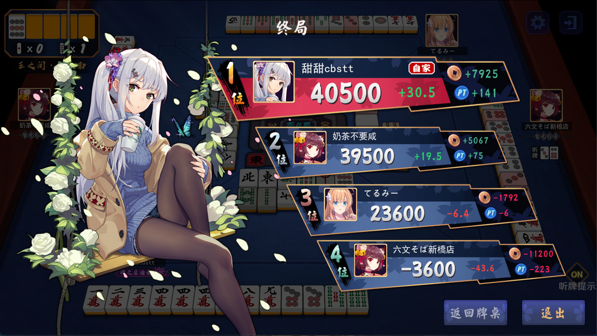
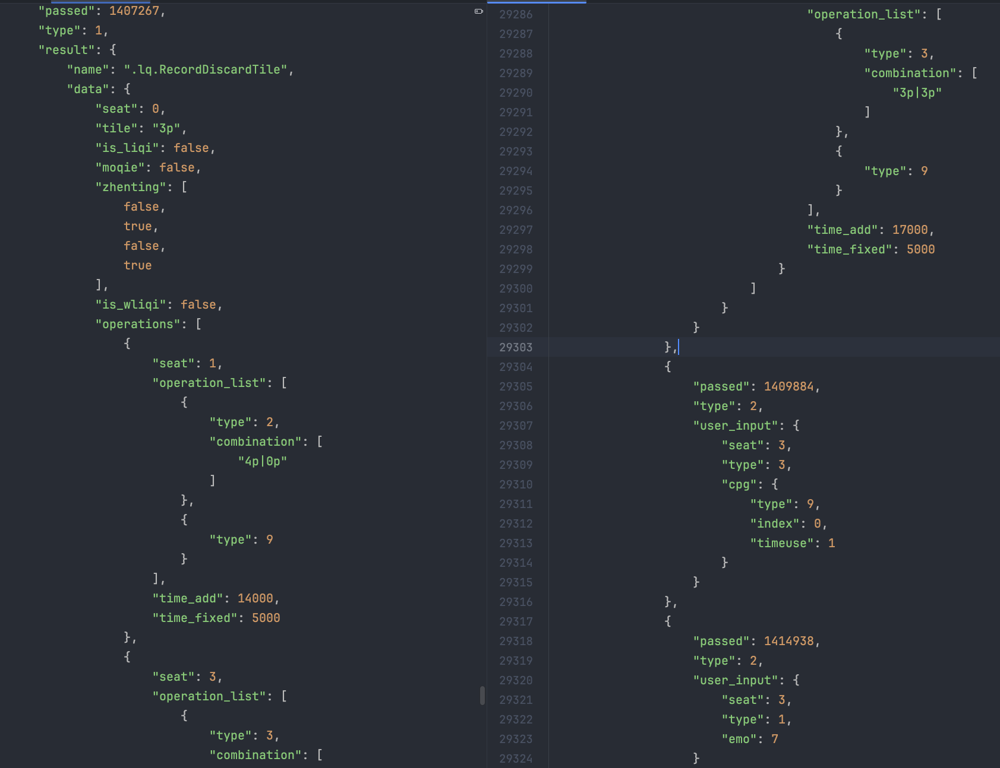
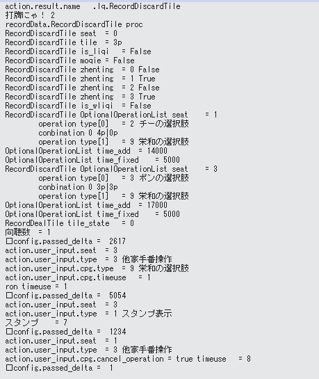
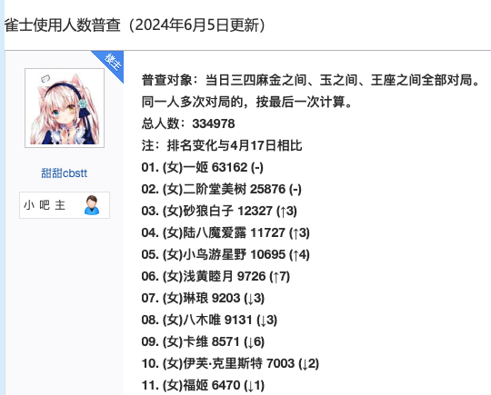
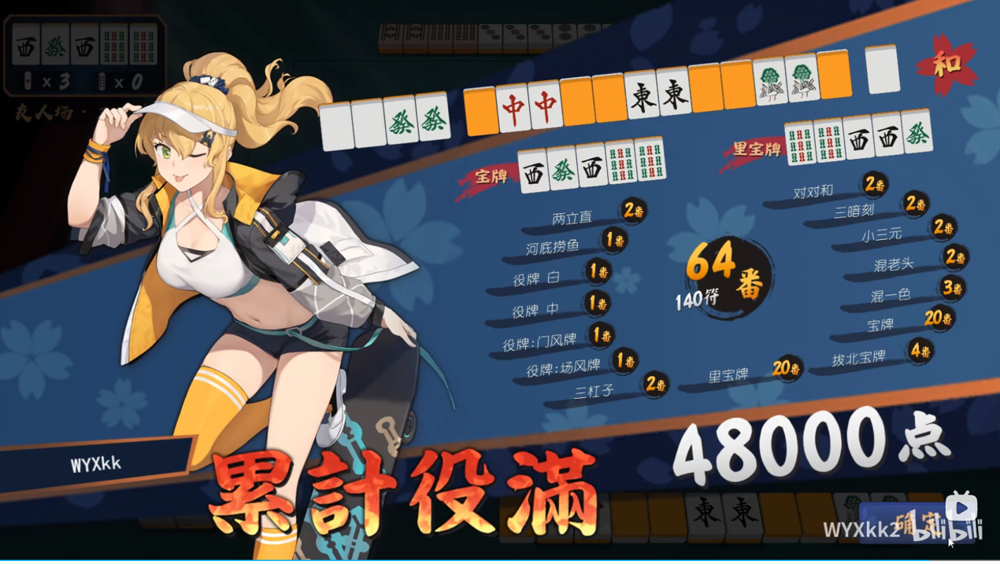
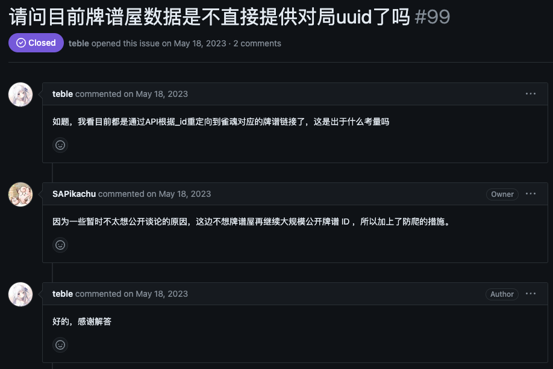
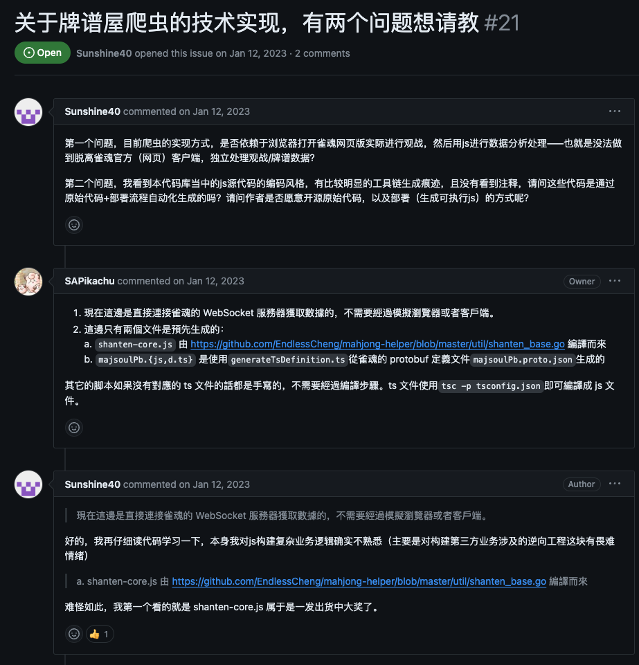

# What can we know through a Mahjong Soul game record

中文版: [README.md](./README.md)

---

reference: https://wikiwiki.jp/majsoul-api/%E7%89%8C%E8%AD%9C%E3%82%92%E8%AA%AD%E3%82%80%E3%81%AB%E3%82%83

If you are good at Japanese, it is recommend to read this cite as it has more detailed information

---

Guiding story "关于烧绳的笑话" is omitted due to the length of this article, you can read the Chinese version on Bilibili if you are interested: [cv36373732](https://www.bilibili.com/read/cv36373732)

## How to get the match info file

Login Mahjong Soul via browser, F12 to open Console, type these characters: (this script is [GetPaipuJSON.js](../../paipu/GetPaipuJSON.js))

```javascript
function paipu(uuid = "") {
    if (!uuid) {
        uuid = prompt("Please Enter a UUID.");
    }
    if (!uuid) {
        return;
    }
    uuid = uuid.replace(/^.*=(.*)_a.*$/, '$1');
    const pbWrapper = net.ProtobufManager.lookupType(".lq.Wrapper");
    const pbGameDetailRecords = net.ProtobufManager.lookupType(".lq.GameDetailRecords");

    function parseRecords(gameDetailRecords, json) {
        try {
            if (gameDetailRecords.version == 0) {
                for (let i in gameDetailRecords.records) {
                    const record = (pbWrapper.decode(gameDetailRecords.records[i]));
                    const pb = net.ProtobufManager.lookupType(record.name);
                    const data = JSON.parse(JSON.stringify((pb.decode(record.data))));
                    json.records[i] = {name:record.name, data:data};
                }
            }
            else if (gameDetailRecords.version == 210715) {
                for (let i in gameDetailRecords.actions) {
                    if (gameDetailRecords.actions[i].type == 1) {
                        const record = (pbWrapper.decode(gameDetailRecords.actions[i].result));
                        const pb = net.ProtobufManager.lookupType(record.name);
                        const data = JSON.parse(JSON.stringify((pb.decode(record.data))));
                        json.actions[i].result = {name:record.name, data:data};
                    }
                }
            }
            else {
                throw ("Unknown version: " + gameDetailRecords.version);
            }
        }
        catch (e) {
            console.log(e);
        }
        return json;
    }

    async function fetchData(url) {
        const response = await fetch(url);
        const arrayBuffer = await response.arrayBuffer();
        return new Uint8Array(arrayBuffer);
    }

    function download(data, uuid) {
        let a = document.createElement("a");
        a.href = URL.createObjectURL(
            new Blob([JSON.stringify(data, null, "  ")],
                {type: "text/plain"}));
        a.download = "paipu_" + uuid + ".json";
        a.style.display = "none";
        document.body.appendChild(a);
        a.click();
        document.body.removeChild(a);
    }

    app.NetAgent.sendReq2Lobby(
        "Lobby",
        "fetchGameRecord",
        {game_uuid:uuid, client_version_string:GameMgr.Inst.getClientVersion()},
        async function(error, gameRecord) {
            if (gameRecord.data == "") {
                gameRecord.data = await fetchData(gameRecord.data_url);
            }
            const gameDetailRecordsWrapper = pbWrapper.decode(gameRecord.data);
            const gameDetailRecords = pbGameDetailRecords.decode(gameDetailRecordsWrapper.data);
            let gameDetailRecordsJson = JSON.parse(JSON.stringify(gameDetailRecords));
            gameDetailRecordsJson = parseRecords(gameDetailRecords, gameDetailRecordsJson);
            gameRecord.data = "";
            let gameRecordJson = JSON.parse(JSON.stringify(gameRecord));
            gameRecordJson.data = {name:gameDetailRecordsWrapper.name, data:gameDetailRecordsJson};
            download(gameRecordJson, uuid);
        });
}
paipu()
```
A tip will occur like the picture below, paste the match link and OK

example: https://game.maj-soul.com/1/?paipu=210815-6da08e40-2605-42fb-a5e3-f8aa5940362a_a111703554



Browser will download a large-size json file, which is the match info file and can be edit by text editors.


json file of example match is stored at [paipu_****.json](../../paipu/paipu_210815-6da08e40-2605-42fb-a5e3-f8aa5940362a.json)

## Form of match info file

This json file contains two parts: `head` and `data`.



`head` contains 6 parts below

`uuid` unique id of match record, which is part of non-anonymous links, `uuid` of example is 210815-6da08e40-2605-42fb-a5e3-f8aa5940362a

`start_time` & `end_time` easy to understand

`config` game type and rules (4P or 3P, friend room or rank match, east or south match).

`accounts` records player info, every item means one player, main info:

`account_id` basic id

`seat` 0, 1, 2, 3 stands for east, south, west, north seated

`nickname` no need to explain

`avatar_id` avatar, aka which character and costume you use

`character` details about the character you use, such as the favorability, whether bonded

`level` & `level3` rank points of 4P & 3P

`avatar_frame` frame around the avatar 

`verified` 1, 2, 0 means account for live broadcast, Pro, common ones

---

`result` records the end points of every player, contains:

`seat` the same as above

`total_point` plain points, which means "素点" in Chinese (I don't know what it is called in English)

`part_point_1` points at the end

`part_point_2` not understand

`grading_score` pt gain or loss

`gold` coppers gain or loss



There is much more info in `data` than in `head` .

`name` of `data` is the function that records match info and is called `.lq.GameDetailRecords`

`version` match before 7/15/2021 is '0', after when is '210715'

## What is in 'actions'

### Due to my poor English, the contents below are not translated, a google translator is recommended.

---

为了描述方便, 这里以下图作为参照



`passed` 已经过去时间, 从匹配成功时算起, 单位毫秒

`type` 这里又分两种 
1. 记录操作大类 `action.user_input.type` 

    1表示发表情

    2表示自家在自摸巡的操作

    3表示他家在自摸巡的操作

    5表示一局结束后点"确定", 

    6表示因无操作自动模切后点击"我回了"

    7表示开始对局

    8和9表示断线和重连

2. 记录具体操作

    `action.result.data.operations.operation_List.type` 可选择项

    `action.user_input.cpg.type` 实际选择项

    他家自摸巡选项: 2: 吃, 3: 碰, 5: 杠, 9: 荣和, 15: 照射

    自家自摸巡选项: 1: 打牌, 4: 暗杠, 6: 加杠, 7: 立直, 8: 自摸, 10: 九种九牌, 11: 拔北, 12: 换牌, 13: 定缺(0,1,2分别代表筒万索), 14: 暗牌, 16: 维持, 17: 暗牌立直

`result` 结果, 也有很多种, 打出牌就是 `lq.RecordDiscardTile`, 摸牌是 `lq.RecordDealTile`, 下一小局就是 `lq.RecordNewRound`, 等等

`seat` 也是同上, 座次

`tile` 操作的牌, 结果是 `lq.RecordDiscardTile` 就是打出的牌, 是 `lq.RecordDealTile` 那就是摸到的牌

`is_liqi` 是否是立直宣言牌, 下面的 `is_wliqi` 也是同理

`zhenting` 这张牌通过了是否会导致玩家振听, 四项分别对应座次的四个玩家

`time_add` 和 `time_fixed` 分别表示附加时间和固定时间, 按照段位的 5+20 的话, 5 是 `time_fixed` , 20 是 `time_add`

剩下的可以看下图的翻译



```text
action.result.name = lq.RecordDiscardTile

recordData.RecordDiscardTile proc
RecordDiscardTile seat = 0  // 座次: 东起
RecordDiscardTile tile = 3p // 打的牌: 3p
RecordDiscardTile is_liqi = False // 是否在立直状态: 否
RecordDiscardTile moqie = False // 是否为摸切: 否
RecordDiscardTile zhenting = 0 False // 是否会该座次的玩家造成振听: 否
RecordDiscardTile zhenting = 1 True
RecordDiscardTile zhenting = 2 False
RecordDiscardTile zhenting = 3 True
RecordDiscardTile is_wliqi = False // 是否是w立直: 否

RecordDiscardTile OptionalOperationList seat = 1 // 选项对应玩家座次: 南起
    operation type[0] = 2 // 选项: 吃
    conbination 0 4p|0p // 组合: 40p
    operation type[1] = 9 // 选项: 荣和
    // 他家自摸巡选项: 2: 吃, 3: 碰, 5: 杠, 9: 荣和, 15: 照射
    // 自家自摸巡选项: 1: 打牌, 4: 暗杠, 6: 加杠, 7: 立直, 8: 自摸, 10: 九种九牌, 11: 拔北,
    //               12: 换牌, 13: 定缺(0,1,2分别代表筒万索), 14: 暗牌, 16: 维持, 17: 暗牌立直
OptionalOperationList time_add = 14000
OptionalOperationList time_fixed = 5000

RecordDiscardTile OptionalOperationList seat = 3 // 选项对应玩家座次: 北起
    operation type[0] = 3 // 选项: 碰
    conbination 0 3p|3p // 组合, 3p3p
    operation type[1] = 9 // 选项: 荣和
OptionalOperationList time_add = 17000
OptionalOperationList time_fixed = 5000

RecordDealTile tile_state = 0 // 手牌状态: 0是闭牌, 1是开牌
// 向听数 ゠ 1

  config.passed_delta = 2617 // 经过时间, 单位毫秒
action.user_input.seat = 3 // 操作玩家座次: 北起
action.user_input.type = 3 // 操作类型: 3: 他家自摸巡的操作, 1表示发表情, 2表示自家在自摸巡的操作
                           // 3表示他家在自摸巡的操作, 5表示一局结束后点"确定"
                           // 6表示因无操作自动模切后点击"我回了", 7表示开始对局, 8和9表示断线和重连
action.user_input.cpg.type = 9 // 操作类型: 荣和
action.user_input.cpg.timeuse = 1 // 使用时间: 1秒
ron_timeuse = 1 // 荣和所用时间: 1秒

  config.passed_delta = 5054 // 经过时间, 单位毫秒
action.user_input.seat = 3 // 操作玩家座次: 北起
action.user_input.type = 1 // 操作类型: 1: 发表情
// 表情种类 = 7 // 第7个表情

  config.passed_delta = 1234 // 经过时间, 单位毫秒
action.user_input.seat = 1 // 操作玩家座次: 南起
action.user_input.type = 3 // 操作类型: 3: 他家自摸巡的操作
action.user_input.cpg.cancel_operation = true // 是否为跳过操作: 是
timeuse = 8 // 所用时间: 8秒

  config.passed_delta = 1
```

该文件保存在 [doc.txt](./doc.txt)

## 牌谱信息文件的应用

1.	查看玩家信息

      这个很容易理解, 不过仅此而已作用就不大了

2.	统计玩家角色, 装扮使用情况, 分析各段位玩家的出现频率与时间

      既然该文件包含对局玩家的详细信息, 那自然可以知道该玩家用的什么角色和哪些装扮,
      这样就可以做到”雀士使用人数普查”, 正好甜甜也在做这个, 还有”一天当中什么时间玉之间雀圣比较多”(yohko 姐姐做过这个),
      “什么装扮受欢迎”, 但这些的前提是能做到可以批量拿到牌谱, 虽说有些脚本能做到下载本账号的最近1000个牌谱,
      但就大量玩家统计而言, 我还是做不到以时间为关键词进行爬取(比如, 抽取某一天金之间及以上段位场的对局),
      但我有两个思路可以供有兴趣的读者尝试:

      a) 查阅雀魂牌谱屋爬取雀魂金之间及以上对局的代码, 弄懂, 掌握其原理, 
      又或者直接从牌谱屋里爬取牌谱(这个作用有限, 也是只能以玩家为单位而不是以时间, 
      牌谱屋作者估计也不会让你直接调用存放在后台的大量数据, 不过我觉得凡事都可以试一下, 
      给牌谱屋作者发个邮件询问也是可行的)
      
      b) 通过雀魂的观战接口, 自己通过脚本录制观战过程中玩家的行为分析得到”自己制作的”牌谱, 
      又或者能发现观战接口与该局的牌谱之间的联系, 很明显这个难度会更大.

      

3.	自制牌谱回放

      老玩家可能知道很久之前b站那个”64番报菜名”系列视频, 比如这个:
      
      [【雀魂】轮到一姬给你报菜名了 64番140符累计役满](https://www.bilibili.com/video/BV1Vr4y1N74o)
      
      但最开始是原作者@WYXkk2的这个视频: 
      
      [【雀魂】（自制回放）如何和出理论最高番的累满](https://www.bilibili.com/video/BV12o4y1971B)
      
      
      
      原作者看到这个系列被蹭热度, 播放量比自己视频高的离谱, 很不爽把脚本隐藏了起来, 
      我之前也试过恳求他能不能发这个脚本, 但被他拒绝了:”可以在github上找教程自己做, 也不难”
      (对于thu确实不难, 实际上确实也不难), 我也确实找到了:
      
      [majsoul-replay-editor](https://github.com/GrandDawn/majsoul-replay-editor)
      
      但这个仓库已经不维护了, 牌谱信息文件经过改版, 也不适用了, 而且我当时很菜搞不懂原理(虽然现在也是), 就耽搁了, 而且到现在也没有专栏在讲怎么实现这个事情(这就有点奇怪了, 就算因为这种东西修改文件可能会导致封号, 但普及技术肯定是好事, 不好的是拥有这种技术的人大肆滥用, 不能因噎废食).

      现在算是大致知道原理了(还没试过, 不知道是否可行):

      a) 首先修改你的对局信息成你想要的样子, 这个经过上面的讲解已经不难了, 不知道操作对应的代码(比如拔北)是什么就去查表, 只不过这个跟写代码一样, 自己初次修改在后面测试的时候可能会有bug, 要多试

      b) 安装抓包软件(Fiddler, Mitmproxy等), 用于拦截请求或者响应, 修改牌谱为我们自定义的内容

      c) 登录雀魂小号(没什么价值的号, 以应对猫粮抽风)到牌谱界面, 查看的时候在抓包软件里面打断点拦截雀魂相关域名的响应, 将对应的内容替换成我们的内容, 继续运行抓包软件, 这样牌谱就会变成我们想要的样子了

此外, 自制回放还可以实现”六倍役满”, 还原天麻等影视作品里面的名场面, 还可以自定义何切讨论等等, 这项技术对于雀魂玩家来说肯定是利大于弊, 普及肯定没有问题.

---

## 下面是我研究如何批量下载牌谱信息文件的一些结论(正确性未知), 供有兴趣者参考

上面在浏览器console界面输入的一大串代码中, 有一个比较关键的调用, 就是这个

`app.NetAgent.sendReq2Lobby("Lobby", “fetchGameRecord”, …, async function(…) …)`

这个函数有四个参数, 后来发现第二个参数 `fetchGameRecord` 是一个 api 调用, 上面这个函数的意思就是给雀魂后端发送一个请求到前台, 
请求对应的内容就是 `fetchGameRecord` 调用, 而这个调用的参数就是 `sendReq2Lobby` 的第三个参数, 第四个函参数应该是对应的响应函数, 
用于处理接收的信息.

然后我发现了下载自己近期所有牌谱的脚本, 它和上面差不多, 不过用到的是另一个调用: `fetchGameRecordList`, 
这个调用和上个相比应该是, 上个调用只能处理一个牌谱, 而这个可以处理一个 list 的牌谱, 后端收到请求的时候会生成或已存在 list, 
然后根据 list 发送响应, 我看那个脚本是在玩家点开牌谱界面的时候, 后端就已经准备好牌谱界面的所有牌谱链接, 
存放在 `uiscript.UI_PaiPu.record_map`中.

再然后我发现了雀魂牌谱信息(.lq)相关的 api 列表网站中:

https://wife.awa.moe/mjsoul/api.html

找到了第三个类似的调用: `fetchGameRecordsDetail`, 但这个调用我还没在脚本中见到使用过, 
倒是见到了请求大会战牌谱的 `fetchCustomizedContestByContestId`, 对应文件是 [taikai.js](../../paipu/taikai.js), 
不过可以肯定的是, 所用的所有调用都跑不出上面这个网站列的范围.

就在我想雀魂牌谱屋用的是上面三个调用中的哪个时, 发现用这三个都搜不到 usage, 后来发现可能是作者有意为之, 
因为上面三个调用都涉及到了牌谱的 uuid, 作者不希望公开 uuid, 然后我没看懂[牌谱屋仓库](https://github.com/SAPikachu/amae-koromo)是怎么爬牌谱的, 就不知道怎么办了(笑死).





牌谱屋仓库有两个, 一个是 [amae-koromo](https://github.com/SAPikachu/amae-koromo) 和 [amae-koromo-scripts](https://github.com/SAPikachu/amae-koromo-scripts) , 研究的话两个应该都要看
